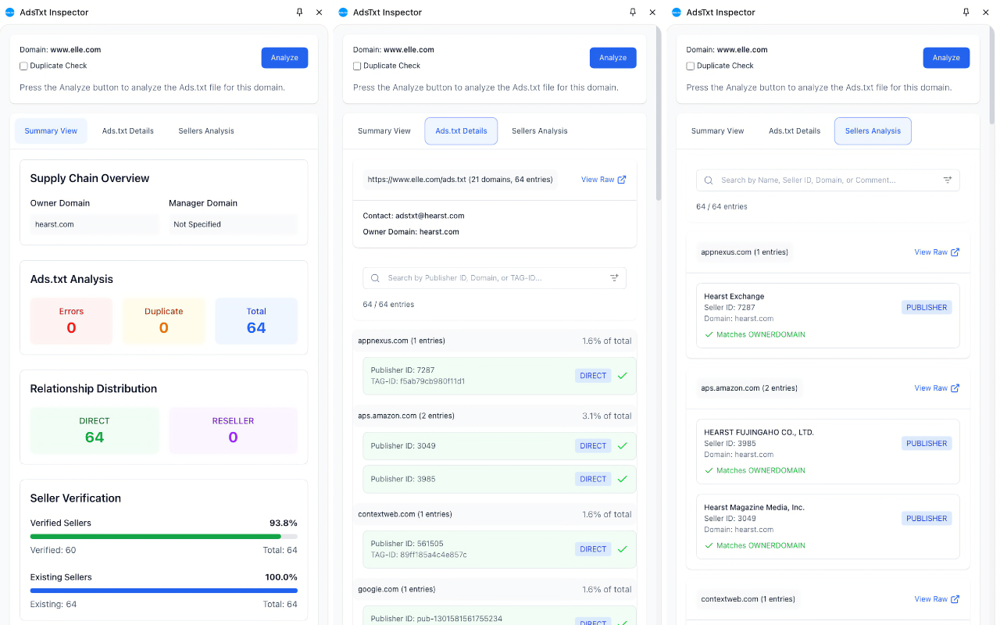

Home / [Schain Guide](./schain-guide)

# AdsTxt Inspector

AdsTxt Inspector is a Chrome extension that helps you validate and analyze Ads.txt and Sellers.json files for programmatic advertising transparency and compliance. It automatically scans these files to detect issues, validates relationships between publishers and sellers, and provides detailed reports.

## Key Features

### Real-time Validation

- **Automatic Analysis**: Scans Ads.txt files on publisher websites with a single click
- **Error Detection**: Immediately identifies syntax errors and duplicate entries
- **Sellers.json Verification**: Cross-validates seller IDs against corresponding Sellers.json files
- **Relationship Verification**: Confirms proper publisher-seller relationships across the supply chain

### Comprehensive Analysis

- **Summary Dashboard**: Visual overview of all advertising relationships
- **Relationship Breakdown**: Analysis of DIRECT vs RESELLER relationships
- **Seller Classification**: Distribution of PUBLISHER, INTERMEDIARY, and BOTH seller types
- **Risk Assessment**: Identifies potential issues in your advertising setup

### Error Detection & Reporting

- **Detailed Error Reports**: Comprehensive error listings with line references
- **Contextual Error Messages**: Clear explanations of detected issues
- **Downloadable Reports**: Export findings as CSV for further analysis
- **Corrected Ads.txt Generation**: Download fixed Ads.txt with errors commented out

### User-Friendly Interface

- **Three Main Views**:
  - Summary View: Quick overview of all key metrics
  - Ads.txt Details: In-depth analysis of each entry
  - Sellers Analysis: Complete breakdown of Sellers.json data
- **Advanced Filtering**: Search and filter capabilities for large datasets
- **Interactive Elements**: Tooltips and highlights for better understanding
- **Data Export**: Download options for further analysis

## How to Use

1. Install the extension from [Chrome Web Store](https://chrome.google.com/webstore/detail/bgojlbkldapcmiimeafldjghcnbgcjha) (or [below](#installation))
2. Navigate to any website you want to analyze
3. Click the extension icon to open the side panel
4. Press "Analyze" to scan Ads.txt and Sellers.json
5. Review the summary, detailed entries, and any validation errors
6. Use the filter and search options to focus on specific data
7. Export results as needed for reporting or correction

## Understanding the Results

The extension provides three main views:

### Summary View

- **Supply Chain Overview**: Shows owner domains and manager domains
- **Ads.txt Analysis**: Displays counts of errors, duplicate entries, and total entries
- **Relationship Distribution**: Visualizes DIRECT vs RESELLER proportions
- **Seller Verification**: Shows percentage of verified and existing sellers
- **Seller Type Distribution**: Breaks down PUBLISHER, INTERMEDIARY, and BOTH categories
- **Risk Assessment**: Lists potential compliance issues and risks

### Ads.txt Details

- **Error Highlight**: All syntax and validation errors clearly marked
- **Entry-by-Entry Analysis**: Complete list of every Ads.txt entry with status
- **Validation Status**: Visual indicators for valid and problematic entries
- **Error Explanations**: Detailed reasons for validation failures
- **Download Options**: Export corrected Ads.txt or CSV report

### Sellers Analysis

- **Full Sellers.json Data**: Complete view of all seller entries
- **Owner/Manager Indicators**: Clear markings for owner and manager domains
- **Confidential Seller Identification**: Highlights confidential and passthrough sellers
- **Advanced Filtering**: Search by name, seller ID, domain, or comment
- **Export Capabilities**: Download seller data as CSV

## Installation

1. Download [adstxt-inspector-build.zip](https://github.com/miyaichi/adstxt-Inspector/releases/tag/latest-build)
2. Unzip to local directory
3. Open `chrome://extensions/`
4. Enable Developer Mode
5. Click `Load unpacked` and select the directory

## Privacy & Security

- Works entirely in your browser
- No data sent to external servers
- Only analyzes publicly available Ads.txt and Sellers.json files
- No tracking or analytics collection

## Reference Documentation

### Ads.txt Specification

- [IAB Tech Lab Ads.txt Specification 1.1](https://iabtechlab.com/wp-content/uploads/2022/04/Ads.txt-1.1.pdf)
- [IAB Tech Lab Ads.txt Implementation Guide](https://iabtechlab.com/wp-content/uploads/2022/04/Ads.txt-1.1-Implementation-Guide.pdf)
- [Ads.txt Validator](https://adstxt.guru/validator/)

### Sellers.json Specification

- [IAB Tech Lab Sellers.json Specification 1.0](https://iabtechlab.com/wp-content/uploads/2019/07/Sellers.json_Final.pdf)
- [FAQ for Sellers.json and SupplyChain Object](https://iabtechlab.com/wp-content/uploads/2019/07/Sellers.json_Final.pdf)
- [Sellers.json Validator](https://www.aditude.com/tools/sellers-json-validator)

## Contributing

The source code is available on [GitHub](https://github.com/miyaichi/adstxt-Inspector). Contributions are welcome!

## Support

If you have any questions, suggestions, or issues, please let us know [here](https://github.com/miyaichi/adstxt-Inspector/issues).

## Acknowledgements

- [IAB Tech Lab](https://iabtechlab.com/) - Ads.txt and Sellers.json specifications
- [Adstxt.guru](https://adstxt.guru/), [Aditude](https://www.aditude.com/) - Validation tools for Ads.txt and Sellers.json
- [Ryota Yamauchi](https://www.facebook.com/ryotayamauchiwj), [Shinji Kawarano](https://www.facebook.com/kawarano) - Debugging and advice