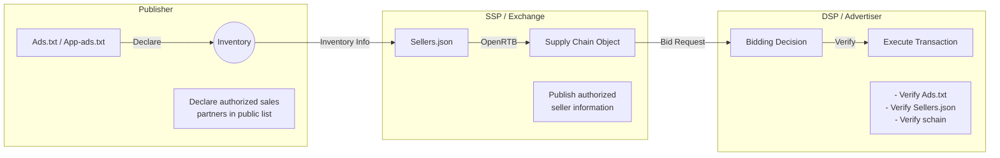

# SupplyChain Object (schain) Guide

## 1. What is SupplyChain Object?

SupplyChain Object (schain) is one of the IAB Tech Lab standards designed to ensure transparency in programmatic advertising. This mechanism provides information about advertising transaction paths included in OpenRTB bid requests and records which supply paths advertising impressions have traversed. It maintains transparency in transactions by sequentially recording detailed information about each participant (Seller ID, domain, etc.) and indicating the completeness of path information through a complete flag.

### 1.1 Transaction Flow and Verification Mechanism

In programmatic advertising transactions, Publishers, SSPs/Exchanges, and DSPs/Advertisers utilize various files to eliminate fraudulent inventory and ensure transparency. The following diagram illustrates this transaction flow:

### 1.2 Role of Each Player and Verification Mechanism

Each player has a distinct role in ensuring transaction transparency. On the Publisher side, authorized sales partners are declared through Ads.txt/App-ads.txt, and authorized trading relationships are published to prevent unauthorized reselling. SSPs/Exchanges publish seller information through Sellers.json and achieve path transparency by generating and transmitting SupplyChain Objects. DSPs/Advertisers eliminate fraudulent inventory by verifying these files' consistency and transaction paths.

These elements work together in verification. Ads.txt verifies authorized sellers, DIRECT/RESELLER relationships, and Seller ID consistency. Sellers.json verifies seller information, transaction types, and domain consistency. The schain verifies transaction path completeness, node information, and complete flag status.

## 2. Significance for Publishers

For Publishers, utilizing SupplyChain Object leads to inventory value enhancement. By proving legitimate routes and protecting inventory from unauthorized reselling and domain spoofing, opportunities arise to secure higher bid prices. Additionally, complete visualization of advertising transaction paths enables the elimination of unnecessary margins and early detection of suspicious transactions. This serves as proof of trustworthy transactions, contributing to long-term brand value maintenance and strengthened relationships with advertisers.

To realize these benefits, Publishers need to undertake several initiatives. First, proper management of Ads.txt is crucial. They must include accurate information, update it regularly, correctly distinguish between DIRECT/RESELLER relationships, and use accurate Seller IDs. Furthermore, by clearly identifying authorized sales partners and appropriately categorizing transaction types, unauthorized reselling can be prevented. Continuous monitoring, including regular Ads.txt updates, transaction path monitoring, and early error detection, is also necessary.

### 2.1 Required Actions for Publishers

1. **Maintain Ads.txt / App-ads.txt**  
   - **Accurately document** information about SSPs/Exchanges/Resellers authorized by your company.  
   - **Promptly update** when new transactions begin or partnerships end to maintain consistency with schain.  
   - Use the correct distinction between `DIRECT` / `RESELLER` and use the **correct Seller ID**.

2. **Verify Provided schain Information**  
   - While Publishers rarely generate schain directly, verify that **partner SSPs/Exchanges correctly send and receive schain**.  
   - Check for **"complete=1" flag settings** and support **full path visualization** whenever possible.

3. **Regular Maintenance**  
   - Failing to **update Ads.txt / App-ads.txt** may result in DSPs blocking as "unknown Seller ID".  
   - As schain usage increases, **consistency with Ads.txt** becomes more important, so **maintain current information**.

## 3. Significance for SSPs/Exchanges

SSPs/Exchanges play a crucial role in the programmatic advertising ecosystem. They ensure transaction transparency through accurate recording of transaction paths, provision of complete schain information, and proper management of Publisher inventory. By preventing fraudulent inventory and ensuring transaction transparency, they maintain compliance and enhance market reliability. This enables them to provide high-quality impressions, improve transaction reliability, and strengthen market competitiveness.

To fulfill these responsibilities, SSPs/Exchanges must take specific actions. In managing Sellers.json, they need to publish accurate information, update regularly, and properly manage Publisher information. In schain implementation, accurate information transmission in OpenRTB, appropriate complete flag settings, and accurate node information recording are important. Additionally, they must build verification systems for checking consistency with Ads.txt, detecting fraudulent transactions, and establishing error reporting frameworks.

### 3.1 Required Actions for SSPs/Exchanges

1. **Set Up and Update Sellers.json**  
   - Prepare and host **Sellers.json** that publishes **authorized Publishers and resellers**.  
   - **Update the file promptly** when Publishers are added/removed or permissions change to maintain current status.

2. **Implement schain Support**  
   - Implement functionality to **include schain nodes in bid requests** (or receive them) in compliance with OpenRTB.  
   - Ensure **consistent correlation** between schain and `Sellers.json` information by correctly linking **Seller ID / Domain information**.

3. **Verify Consistency with Ads.txt / App-ads.txt**  
   - Establish mechanisms to check for **invalid Seller IDs** by cross-referencing Publisher's Ads.txt / App-ads.txt.  
   - Maintain a clean marketplace by implementing **transaction blocks** and **Publisher notifications** when potentially fraudulent inventory is detected.