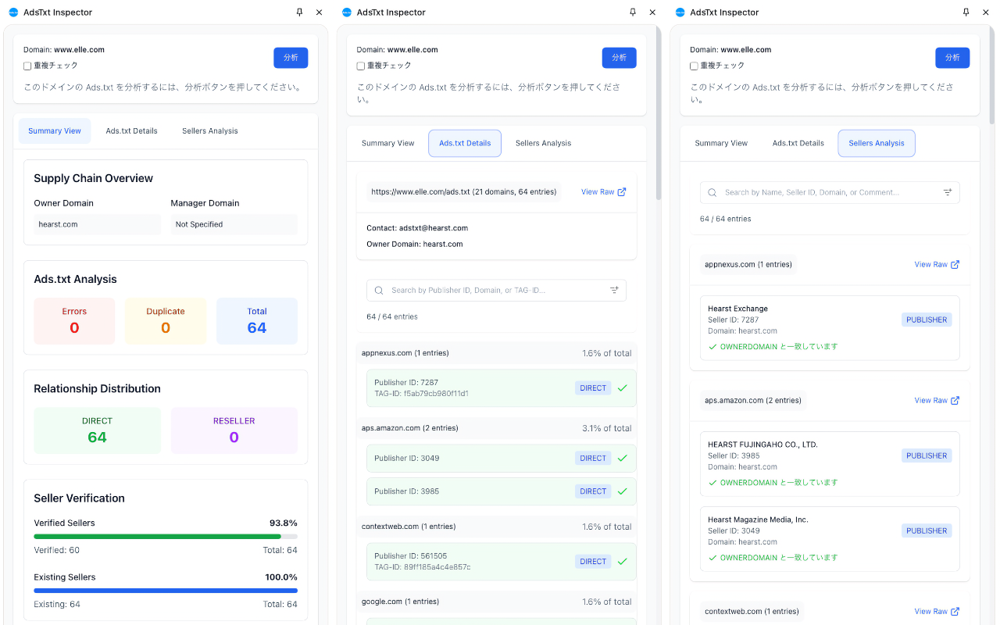

Home / [Supply Chain ガイド](./schain-guide)

# AdsTxt Inspector

AdsTxt Inspectorは、プログラマティック広告の透明性とコンプライアンスを確保するために、Ads.txtやSellers.jsonファイルを検証・分析するChrome拡張機能です。これらのファイルを自動的にスキャンし、問題を検出、パブリッシャーとセラーの関係を検証し、詳細なレポートを提供します。Ads.txt, Sellers.jsonを適切に実装することで、[サプライチェーン](./schain-guide)の透明性を向上させ、不正広告のリスクを軽減できます。

## 主な特徴

### リアルタイム検証

- **自動分析**: ワンクリックでパブリッシャーウェブサイト上のAds.txtファイルをスキャン
- **エラー検出**: 構文エラーや重複エントリを即座に識別
- **Sellers.json検証**: 対応するSellers.jsonファイルとセラーIDをクロス検証
- **関係検証**: サプライチェーン全体でパブリッシャーとセラーの関係を正確に確認

### 詳細な分析

- **概要ダッシュボード**: すべての広告関係の視覚的概要
- **関係の内訳**: DIRECT（直接）とRESELLER（リセラー）の関係の分析
- **セラー分類**: PUBLISHER、INTERMEDIARY、BOTHのセラータイプの分布
- **リスク評価**: 広告設定における潜在的な問題を特定

### エラー検出とレポート

- **詳細なエラーレポート**: 行参照付きの包括的なエラーリスト
- **文脈に応じたエラーメッセージ**: 検出された問題の明確な説明
- **ダウンロード可能なレポート**: さらなる分析のためにCSV形式で結果をエクスポート
- **修正済みAds.txtの生成**: エラーがコメントアウトされた修正Ads.txtをダウンロード

### ユーザーフレンドリーなインターフェース

- **3つの主要ビュー**:
  - 概要ビュー: すべての主要指標の簡潔な概要
  - Ads.txt詳細: 各エントリの詳細分析
  - Sellers分析: Sellers.jsonデータの完全な内訳
- **高度なフィルタリング**: 大規模データセット向けの検索とフィルタリング機能
- **インタラクティブ要素**: より理解しやすいツールチップとハイライト
- **データエクスポート**: さらなる分析のためのダウンロードオプション

## 使用方法

1. [Chromeウェブストア](https://chrome.google.com/webstore/detail/bgojlbkldapcmiimeafldjghcnbgcjha)(または[下記](#インストール))から拡張機能をインストール
2. 分析したいウェブサイトにアクセス
3. 拡張機能のアイコンをクリックしてサイドパネルを開く
4. 「分析」を押してAds.txtとSellers.jsonをスキャン
5. 概要、詳細エントリ、検証エラーを確認
6. フィルタと検索オプションを使用して、特定のデータに焦点を当てる
7. 必要に応じて結果をエクスポートして報告や修正に使用

## 結果の理解

この拡張機能は、以下の3つの主要なビューを提供します：

### 概要ビュー

- **サプライチェーン概要**: オーナードメインとマネージャードメインを表示
- **Ads.txt分析**: エラー数、重複エントリ数、総エントリ数を表示
- **関係分布**: DIRECTとRESELLERの比率を視覚化
- **セラー検証**: 検証済みおよび存在するセラーの割合を表示
- **セラータイプ分布**: PUBLISHER、INTERMEDIARY、BOTHのカテゴリの内訳
- **リスク評価**: コンプライアンスの問題やリスクのリスト

### Ads.txt詳細

- **エラーハイライト**: すべての構文と検証エラーを明確にマーク
- **エントリ別分析**: ステータス付きのすべてのAds.txtエントリの完全リスト
- **検証ステータス**: 有効および問題のあるエントリの視覚的インジケータ
- **エラー説明**: 検証失敗の詳細な理由
- **ダウンロードオプション**: 修正済みAds.txtまたはCSVレポートをエクスポート

### Sellers分析

- **完全なSellers.jsonデータ**: すべてのセラーエントリの完全なビュー
- **オーナー/マネージャーインジケータ**: オーナードメインとマネージャードメインの明確なマーキング
- **機密セラーの識別**: 機密およびパススルーセラーのハイライト
- **高度なフィルタリング**: 名前、セラーID、ドメイン、コメントで検索
- **エクスポート機能**: セラーデータをCSVとしてダウンロード

## インストール 

1. [adstxt-inspector-build.zip](https://github.com/miyaichi/adstxt-Inspector/releases/tag/latest-build)をダウンロードします。
2. ローカルディレクトリに解凍します。
3. `chrome://extensions/` を開きます。
4. デベロッパーモードを有効にします。
5. `パッケージ化されていない拡張機能を読み込む` をクリックし、ディレクトリを選択します。

## プライバシーとセキュリティ

- ブラウザ上で完全に動作します
- 外部サーバーにデータを送信しません
- 一般公開されているAds.txtとSellers.jsonファイルのみを分析します
- トラッキングやアナリティクスの収集はありません

## 参考ドキュメント

### Ads.txt 規格

- [IAB Tech Lab Ads.txt Specification 1.1](https://www.pier1.co.jp/wp-content/uploads/2024/02/Ads.txt-1.1-ja.pdf) (日本語)
- [IAB Tech Lab Ads.txt Implementation Guide](https://www.pier1.co.jp/wp-content/uploads/2024/02/Ads.txt-1.1-Implementation-Guide-ja.pdf) (日本語)
- [Ads.txt Validator](https://adstxt.guru/validator/)

### Sellers.json 規格

- [IAB Tech Lab Sellers.json Specification 1.0](https://www.pier1.co.jp/wp-content/uploads/2024/02/Sellers.json_Final-ja.pdf) (日本語)
- [FAQ for Sellers.json and SupplyChain Object](https://www.pier1.co.jp/wp-content/uploads/2024/02/FAQ-for-sellers.json_supplychain-objec-ja.pdf) (日本語)
- [Sellers.json Validator](https://www.aditude.com/tools/sellers-json-validator)

## 貢献

ソースコードは[GitHub](https://github.com/miyaichi/adstxt-Inspector)にあります。貢献を歓迎します！

## サポート

質問や提案、問題がある場合は、[こちら](https://github.com/miyaichi/adstxt-Inspector/issues) からお知らせください。

## 謝辞

- [IAB Tech Lab](https://iabtechlab.com/) - Ads.txtとSellers.jsonの規格策定
- [Adstxt.guru](https://adstxt.guru/)、[Aditude](https://www.aditude.com/) - Ads.txtとSellers.jsonの検証ツール
- [Ryota Yamauchi](https://www.facebook.com/ryotayamauchiwj)、[Shinji Kawarano](https://www.facebook.com/kawarano) - デバッグとアドバイス